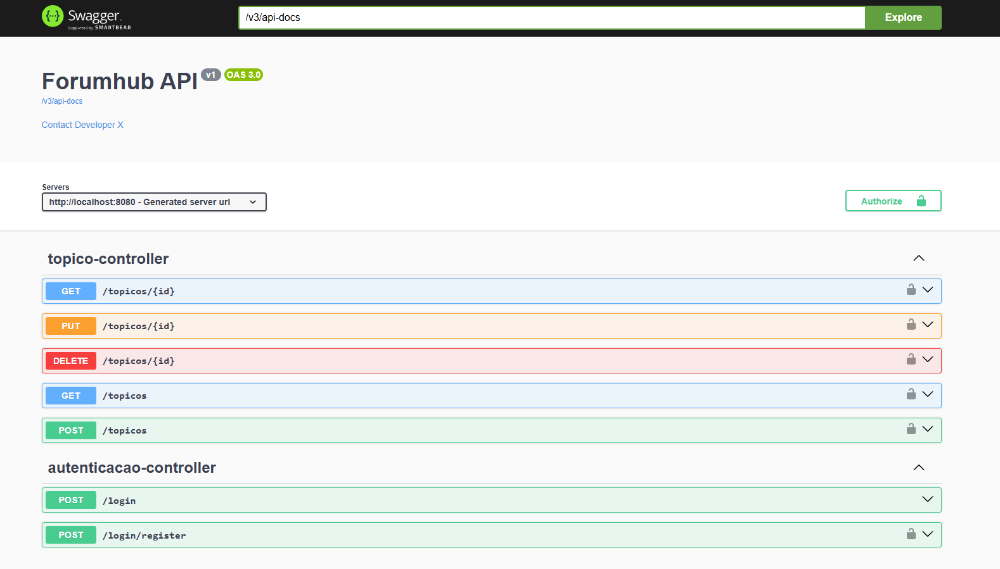

# Forum-Hub

## Badge

Badge conquistado por ter desenvolvido este projeto com a Alura no programa ONE - "Oracle Next Education" em parceria com a Oracle:

O Fórum Hub é um desafio realizado pela Alura no curso de formação Back-End onde criamos uma API REST. Tive a oportunidade de aplicar conceitos avançados de Java e Spring Boot, como criação de endpoints, implementação de camadas de segurança, entre outros.

## Endpoints

Atualmente temos diversos endpoints:

- [GET] -> "/topicos", para listar todos os tópicos;
- [GET] -> "/topicos/{id}", para detalhar um tópico específico, tendo acesso também a suas respostas;
- [POST] -> "/topicos", para criar um novo tópico;
- [PUT] -> "/topicos/{id}", para alterar as informações de um tópico;
- [DELETE] -> "/topicos/{id}", para deletar um tópico do banco de dados.
- [POST] -> "/respostas", para escrever uma resposta a um topico.
- [GET] -> "/respostas/usuarios/{id}", para ver todas as respostas de um determinado usuario.
- [GET] -> "/respostas/topicos/{id}", para ver somente as respostas de um determinado topico.
- [POST] -> "/cursos", para criar um novo curso, deve-se seguir as categorias do enum Categorias.
- [GET] -> "/cursos/{id}", para ver os detalhes de um curso.
- [GET] -> "/usuarios/{id}", para ver os detalhes de um usuario.

## Tecnologias utilizadas

- Java 21
- Spring Boot 3
- Lombok
- MySql
- JWT
- Flyway
- SpringDoc 3
- IntelliJ IDEA
- Postman

## Como implementar

1. Faça o clone do repositório ou o baixe;
2. Crie o banco de dados que deseja armazenar os dados;
3. Verifique o arquivo applications.properties e crie variáveis de ambiente condizentes com as presentes nesse arquivo;
4. Rode o projeto, isso fará com que as migrations sejam executadas e seu banco esteja pronto para uso;
5. Faça as requisições por meio de alguma ferramenta de sua preferência.
   - Há a possibilidade de verificar e realizar as requisições da api utilizando a documentação do projeto através do caminho "/swagger-ui.html".

